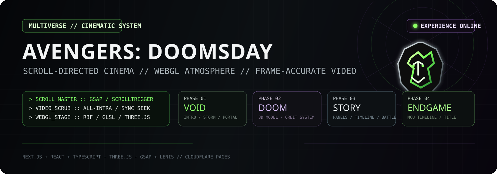
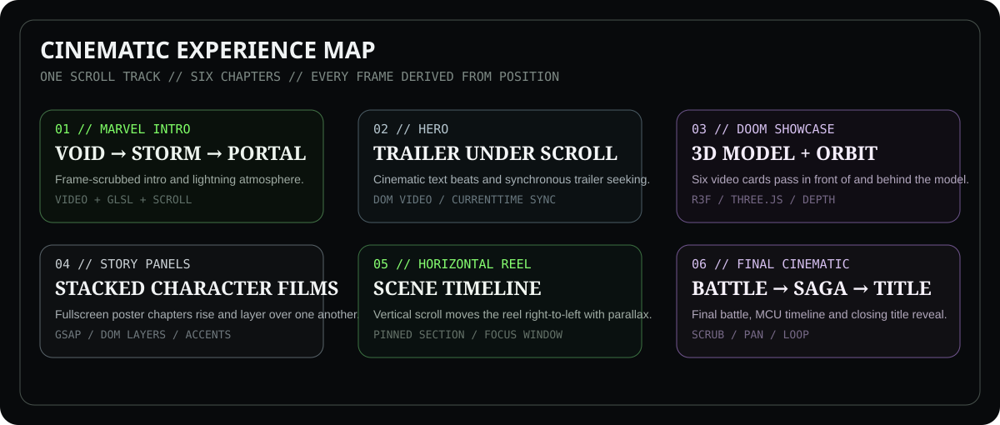
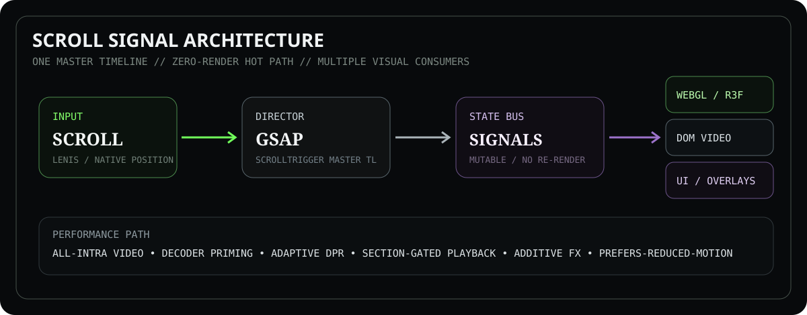

<p align="center">
  
</p>

<p align="center">
  <a href="https://avengers-doomsday-f28.pages.dev/">
    
  </a>
  
  
  
  
  
</p>

> A fully **scroll-directed cinematic web experience** built as a non-commercial fan concept and front-end engineering showcase. Video, WebGL atmosphere, camera motion, 3D presentation and titles are synchronized to scroll position so the page behaves more like an interactive trailer than a conventional website.

> **Fan-project notice:** this project is not affiliated with, endorsed by, or sponsored by Marvel or The Walt Disney Company. Marvel-related characters, names and trademarks belong to their respective rights holders.

<p align="center">
  
</p>

## ✦ SYSTEM // EXPERIENCE MAP

The site is organized as one continuous cinematic track: a storm-driven intro, a scroll-controlled hero film, a 3D character showcase, stacked story chapters, a horizontal scene reel, and a final battle / saga / title sequence.

<p align="center">
  
</p>

<p align="center">
  
</p>

## ✦ AVENGERS // CHARACTER SIGNALS

The character panel now uses recognizable franchise marks, emblems and signature objects instead of custom-drawn substitutes.

<table>
  <tr>
    <td align="center" width="25%">
      <br />
      <strong>DOCTOR DOOM</strong>
    </td>
    <td align="center" width="25%">
      <br />
      <strong>THOR</strong>
    </td>
    <td align="center" width="25%">
      <br />
      <strong>LOKI</strong>
    </td>
    <td align="center" width="25%">
      <br />
      <strong>CAPTAIN AMERICA</strong>
    </td>
  </tr>
  <tr>
    <td align="center" width="25%">
      <br />
      <strong>CYCLOPS</strong>
    </td>
    <td align="center" width="25%">
      <br />
      <strong>SHANG-CHI</strong>
    </td>
    <td align="center" width="25%">
      <br />
      <strong>FANTASTIC FOUR</strong>
    </td>
    <td align="center" width="25%">
      <br />
      <strong>AVENGERS</strong>
    </td>
  </tr>
</table>

> This is a non-commercial fan-project presentation. Character names, emblems, props and related franchise marks belong to their respective rights holders.

<p align="center">
  
</p>

## ✦ CORE // SCROLL ARCHITECTURE

A single scrubbed GSAP timeline acts as the director. Scroll position feeds the master timeline, which writes into a mutable signal bus. WebGL, DOM video and overlay systems consume those values without pushing per-frame data through React state.

<p align="center">
  
</p>

<p align="center">
  
</p>

## ✦ Overview

- **Name:** AVENGERS: DOOMSDAY
- **What it is:** An Awwwards-style, single-page, scroll-controlled cinematic experience — a void erupts into a storm, the Marvel intro scrubs frame-by-frame, a portal dive carries you into a Doctor Doom hero trailer, a 3D Doom model orbited by six auto-playing character videos, stacked movie-poster story panels, a horizontal scene timeline, a scroll-scrubbed final battle, the entire MCU timeline, and the **AVENGERS: DOOMSDAY** title reveal — then a minimal footer.
- **Inspiration:** Marvel Studios' cinematic trailers and premium Awwwards "Site of the Year" scroll experiences.
- **Purpose:** A portfolio piece demonstrating scroll orchestration, WebGL atmosphere, frame-accurate video scrubbing, and performance-minded motion design.

---

## ✦ Features

| Feature | Description |
|---|---|
| **Marvel Intro** | Void → green lightning storm → the Marvel intro clip **scrubbed frame-by-frame** by scroll (forward plays, up rewinds). |
| **Scroll-Controlled Hero** | A cinematic text sequence, then a Doctor Doom trailer that scrubs with scroll — never autoplays, always driven by the user. |
| **3D Doctor Doom Section** | A procedural Doctor Doom model (Three.js) at centre with idle breathing, cape sway, cursor-look, and scroll rotation under cinematic rim lighting. |
| **Six Interactive Character Cards** | Six cards orbit the 3D model like satellites; the active card comes forward while the others pass **genuinely behind** the model (z-index straddle for real depth). |
| **Auto-Playing Character Videos** | Each card plays a looping, muted, `playsInline`, controls-free video with `object-fit: cover` — cinematic panels, not media players. |
| **Cinematic Storytelling Panels** | Six fullscreen movie-poster panels (Doctor Doom, Thor, Loki, Cyclops, Shang-Chi, Fantastic Four) rise and stack over one another, each with a bottom-right title, description, and per-panel accent theme. |
| **Horizontal Scroll Timeline** | A pinned section where vertical scroll drives a strip of scene videos **right-to-left**, each coming into focus at centre with parallax. |
| **Final Cinematic Section** | A scroll-scrubbed battle (Thor → Doom → Captain America) → the full MCU timeline panning vertically → the **AVENGERS: DOOMSDAY** title reveal (auto-playing loop). |
| **Footer** | A minimal, elegant footer that rises to close the experience. |
| **GSAP ScrollTrigger** | One scrubbed master timeline maps scroll position onto every cinematic value. |
| **Three.js / React Three Fiber** | A single transparent WebGL canvas provides the atmosphere — GLSL particles, volumetric fog, fractal lightning, portal, sparks — layered over the DOM video. |
| **Responsive Design** | Fluid layout, viewport-relative sizing, and mobile-aware orbit/typography across desktop, laptop, tablet, and mobile. |
| **Performance Optimizations** | All-intra video encoding for instant seeking, decoder priming, scroll-synchronous seeking (not rAF-throttled), adaptive DPR, additive-only atmosphere, and a zero-re-render signal bus. |
| **Completely silent** | No audio anywhere, by design. |

---

## ✦ Technology Stack

- **[Next.js 16](https://nextjs.org/)** (App Router, Turbopack) — framework & build
- **[React 19](https://react.dev/)** + **[TypeScript](https://www.typescriptlang.org/)**
- **[Three.js](https://threejs.org/)** + **[React Three Fiber](https://r3f.docs.pmnd.rs/)** + **[@react-three/drei](https://github.com/pmndrs/drei)** + **@react-three/postprocessing** — WebGL scene
- **[GSAP](https://gsap.com/)** + **ScrollTrigger** — the scrubbed master timeline
- **[Lenis](https://lenis.darkroom.engineering/)** — smooth inertial scrolling
- **[Zustand](https://zustand.docs.pmnd.rs/)** — discrete UI state
- **[Framer Motion](https://www.framer.com/motion/)** — available for supporting UI motion
- **next/font** (Anton + Chakra Petch), **CSS Modules** + a small global stylesheet

> Not used: Tailwind, Vite, a component library. Styling is hand-authored CSS Modules + custom GLSL shaders.

---

## ✦ Project Structure

```
avengers-doomsday/
├── app/
│   ├── layout.tsx          # Root layout: fonts, SEO metadata, <html>/<body>
│   ├── page.tsx            # Renders <Experience/>
│   ├── globals.css         # Global cinematic base + layer z-index system
│   └── favicon.ico
├── components/
│   ├── Experience.tsx      # THE DIRECTOR — the scrubbed GSAP/ScrollTrigger master timeline
│   ├── webgl/              # The Three.js / R3F atmosphere (one transparent canvas)
│   │   ├── CinematicCanvas.tsx   # Transparent <Canvas>, adaptive DPR
│   │   ├── CameraRig.tsx         # Scroll/pointer-driven camera
│   │   ├── ParticleField.tsx     # GLSL dust + embers
│   │   ├── VolumetricFog.tsx     # Additive fog planes
│   │   ├── Lightning.tsx         # Procedural fractal bolts
│   │   ├── Portal.tsx, Sparks.tsx, SceneDriver.tsx, Effects.tsx
│   │   └── showcase/             # DoomModel.tsx (procedural 3D Doom) + Showcase.tsx (lights)
│   ├── overlays/           # DOM overlays driven by scroll signals
│   │   ├── VideoLayer.tsx        # The scroll-scrubbed <video> trailers (Marvel / Hero / Battle)
│   │   ├── CharacterOrbit.tsx    # Six orbiting auto-play video cards (Section 3)
│   │   ├── StoryStack.tsx        # Six stacked movie-poster panels (Section 4)
│   │   ├── HorizontalReel.tsx    # Horizontal scene timeline (Section 5)
│   │   ├── TimelineImage.tsx     # MCU timeline scroll-pan (ending)
│   │   ├── TitleReveal.tsx       # AVENGERS DOOMSDAY title video (ending)
│   │   ├── CinematicText.tsx     # Scroll-timed cinematic copy beats
│   │   └── FlashOverlay.tsx
│   └── ui/                 # SiteHeader, HeroOverlay, SiteFooter, ScrollCue
├── lib/
│   ├── constants.ts        # Palette, asset paths, scroll section heights, TIMELINE_UNITS
│   ├── signals.ts          # Per-frame mutable signal bus (zero React re-renders in the hot path)
│   ├── store.ts            # Zustand discrete state (phase, ready, reduce-motion)
│   ├── videos.ts           # Video registry + scrub/prime helpers
│   ├── useRaf.ts, useLenis.ts, gsap.ts   # Shared rAF loop, Lenis setup, GSAP+ScrollTrigger setup
│   └── glsl.ts, textParticles.ts         # Shader chunks + helpers
├── public/
│   ├── videos/             # All-intra scrub videos, auto-play clips, and posters
│   └── story/              # Story-panel artwork + the MCU timeline image
├── next.config.ts          # reactStrictMode: false (imperative WebGL lifecycle)
├── tsconfig.json
└── package.json
```

**How it works (architecture in one paragraph):** There is one fixed full-viewport "stage" and one tall invisible scroll-track. A single GSAP timeline is *scrubbed* by one ScrollTrigger over that track; it tweens a mutable singleton in `lib/signals.ts`. Every visual — the WebGL atmosphere, the DOM `<video>` elements, the orbiting cards, the stacked panels — reads from those signals each frame, so the whole film is a pure function of scroll position. Trailers are **real DOM `<video>` elements** (not WebGL textures) whose `currentTime` is seeked synchronously on the scroll event, and they're encoded **all-intra** so every seek is instant in both directions.

---

## ✦ The Scroll Experience

| # | Section | What happens |
|---|---|---|
| 1 | **Marvel Intro** | A black void builds into a green lightning storm; the Marvel intro clip scrubs frame-by-frame, then a portal dive carries the camera onward. |
| 2 | **Hero** | The website chrome enters; a cinematic text sequence plays, then the Doctor Doom trailer appears fullscreen and scrubs with scroll. |
| 3 | **Doctor Doom Showcase** | A 3D Doom model rises at centre; six character videos fly in and orbit him, active card forward, others behind — real depth. |
| 4 | **Story Panels** | Six movie-poster panels (Doom · Thor · Loki · Cyclops · Shang-Chi · Fantastic Four) rise and stack, each with bottom-right title + accent theme. |
| 5 | **Horizontal Timeline** | A pinned strip of scene videos travels right-to-left, each focusing at centre with parallax. |
| 6 | **Final Cinematic Ending** | A scroll-scrubbed battle (Thor → Doom → Captain America) → the MCU timeline pans through 18 years of saga → the **AVENGERS: DOOMSDAY** title reveal loops → the footer rises. |

---

## ✦ Getting Started

**Prerequisites:** Node.js **20.9+** and npm.

```bash
# 1. Clone the repository
git clone <your-repo-url>
cd avengers-doomsday

# 2. Install dependencies
npm install

# 3. Run the development server
npm run dev
# open http://localhost:3000

# 4. Build for production
npm run build

# 5. Run the production build locally
npm run start
```

> Best experienced on desktop with a modern GPU. The experience is intentionally long — scroll all the way through for the full film.

---

## ✦ Performance

- **All-intra video encoding** — the scroll-scrubbed trailers are re-encoded so every frame is a keyframe, making forward/reverse seeks instant with no stutter.
- **Real DOM videos + scroll-synchronous seeking** — `currentTime` and opacity are set on the actual scroll event (not a throttled rAF loop), so scrubbing stays locked to the pointer even under load.
- **Decoder priming** — a muted `play → pause` warms each decoder so the first seeked frame paints immediately.
- **Section-gated playback** — auto-play videos play only while their section is on-screen and pause otherwise, so nothing decodes needlessly.
- **Zero-re-render signal bus** — per-frame values live in a mutable singleton, not React state, keeping the hot path allocation- and render-free.
- **Adaptive DPR + additive-only atmosphere** — the WebGL layer scales resolution to the device and uses cheap additive materials; no heavy post-processing in the render path.
- **Responsive design** — viewport-relative units and mobile-aware orbit radius, typography, and layout across all screen sizes.
- **Optimized assets** — videos are compressed H.264/MP4 with `+faststart`; images are progressive JPEGs sized for their use.

---

## ✦ Deployment — Cloudflare Pages

This project is configured as a **static Next.js export** so it can be deployed directly to Cloudflare Pages. The production build is generated in `out/`.

### Cloudflare Pages settings

- **Framework preset:** Next.js (Static HTML Export), or configure manually
- **Production branch:** `main`
- **Build command:** `npm run build`
- **Build output directory:** `out`
- **Root directory:** `/`
- **Node.js:** 20+ (the project requires Node.js 20.9+)
- **Environment variables:** none required
- **Optional:** `NEXT_PUBLIC_SITE_URL=https://your-domain.example` for correct social-share metadata

Cloudflare Pages serves the generated `out/` directory as static assets. The project does not require a Pages Function or server runtime.

### Local verification

```bash
npm ci
npm run build
# inspect the generated ./out directory
```

### Git deployment

1. Push this project to GitHub.
2. In Cloudflare, open **Workers & Pages → Create application → Pages → Import an existing Git repository**.
3. Select the repository and use the settings above.
4. Deploy.

### Direct deployment with Wrangler

After installing/authenticating Wrangler, the generated static directory can also be deployed directly:

```bash
npx wrangler pages deploy out --project-name avengers-doomsday
```

> The project is a non-commercial Marvel-inspired fan concept. It is not affiliated with or endorsed by Marvel Studios or Disney.

---

## ✦ CREDITS // PROJECT

<p align="center">
  <strong>Built by Creatary Labs</strong><br />
  <sub>Cinematic WebGL & scroll experience · 2026</sub>
</p>

### Project credits

- A **Marvel-inspired fan experience** — built for **educational / portfolio** purposes only, not affiliated with Marvel Studios or Disney. All characters, names, and trailers are the property of their respective owners.
- Video and image assets are used solely as illustrative placeholders for a non-commercial concept demo.
- **Built with:** Next.js, React, TypeScript, Three.js, React Three Fiber, drei, GSAP + ScrollTrigger, Lenis, Zustand.
- Fonts: **Anton** and **Chakra Petch** via Google Fonts.

---

*The multiverse is breaking. Only legends remain.*
